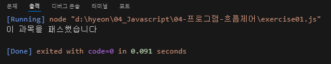
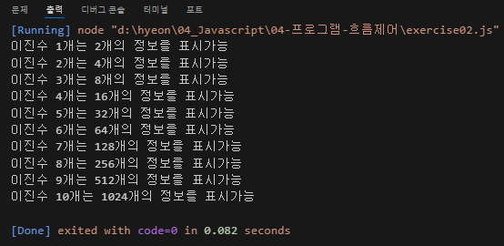
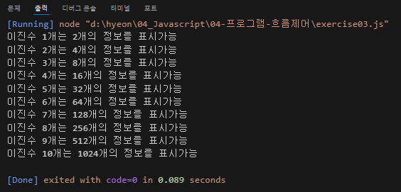

# 이승현 프로그램 흐름제어 연습문제 과제
---
> 2024-08-19


## 문제1
```javascript
const 수학 = 'B';

if ( 수학=='A'||'B'||'C' ) {
    console.log('이 과목을 패스했습니다');
}
else {
    console.log('이 과목을 패스하지 못했습니다');
}
```
실행 결과의 스크린샷




## 문제2
```javascript
let i = 1;
let b = 1;

while ( i < 11 ) {
    b *= 2;
    console.log('이진수 %d개는 %d개의 정보를 표시가능', i, b);
    i++;
}
```
실행 결과의 스크린샷




## 문제3
```javascript

let b = 1;

for( let i=1; i<11; i++ ){
    b *= 2;
    console.log('이진수 %d개는 %d개의 정보를 표시가능', i, b);
}
```
실행 결과의 스크린샷

