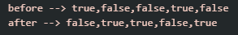

# 이승현 - 배열 연습문제 과제
---
> 2024-08-21


## 문제1
```javascript
const check_list = [ true, false, false, true, false ];
console.log( "before --> " + check_list );

for ( let i=0; i<check_list.length; i++ ) {
    check_list[i]? check_list[i]=false : check_list[i]=true;
    
}

console.log( "after --> " + check_list );
```
실행 결과의 스크린샷




## 문제2
```javascript
const grade = [ 75, 82, 91 ];

let sum = 0;

for ( let i=0; i<grade.length; i++ ) {
    sum += grade[i];
}

let avg = sum / grade.length;

console.log("총점 : " + sum);
console.log("평균 : " + avg);
```
실행 결과의 스크린샷


## 문제3
```javascript
const work = [7,5,5,5,5,10,7];

let sum = 0;
let money;

for ( let i=0; i<work.length; i++ ) {
    if ( i<4 ) {
        money=4500;
    }
    else {
        money=5200;
    }
    sum += money;
}

console.log( "일주일간의 총 급여 : " + sum );
```
실행 결과의 스크린샷


## 문제4
```javascript
const price = [ 38000, 20000, 17900, 17900 ];
const qty = [ 6, 4, 3, 5 ];

let money = 0;

for ( let i=0; i<price.length; i++ ) {
    money += price[i]*qty[i];
}

console.log("총 결제금액 : " + money);
```
실행 결과의 스크린샷


## 문제5,문제6
```javascript
const price = [ 38000, 20000, 17900, 17900 ];
const qty = [ 6, 4, 3, 5 ];
let arr = new Array(4);
//console.log(arr);

let money = 0;

for ( let i=0; i<price.length; i++ ) {
    money += price[i]*qty[i];

    arr[i] = price[i]*qty[i];
}

console.log("상품금액 : " + arr);


/* -- -- -- -- -- -- -- -- -- 문제5 -- -- -- -- -- -- -- -- -- --  */
let max = arr[0];

for ( let i=1; i<arr.length; i++ ) {    
    if ( max < arr[i] ) {
        max = arr[i];
    }
}
console.log("가장 비싼 항목의 상품금액 : " + max);


/* -- -- -- -- -- -- -- -- -- 문제6 -- -- -- -- -- -- -- -- -- --  */
let free = 0;

for ( let i=0; i<arr.length; i++ ) {
    if ( arr[i] >= 80000 ) {
        free++;
    }
}

console.log("무료 배송되는 항목 : " + free);
```


## 문제7
```javascript
const money = [ 209000, 109000, 119000, 109000, 94000 ];

for ( let i=0; i<money.length-1; i++ ) {
    for ( let j=i+1; j<money.length; j++ ) {
        if ( money[i] > money[j] ) {
            const tmp = money[i];
            money[i] = money[j];
            money[j] = tmp;
        }
    }
}

console.log(money);
```
실행 결과의 스크린샷


## 문제8
```javascript
const arr = [ 5,3,2,8,9 ];
console.log(arr);

const repeat = arr%2==0 ? arr.length/2 : (arr.length-1)/2;
//console.log(repeat);

for ( let i=0; i<repeat; i++ ) {
    const tmp = arr[i];
    arr[i] = arr[arr.length-i-1];
    arr[arr.length-i-1] = tmp;
}

console.log(arr);
```
실행 결과의 스크린샷


## 문제9
```javascript
const student = [ "둘리", "도우너", "또치", "희동" ];
const grade = [ 
    [ 78, 89, 96 ], 
    [ 62, 77, 67 ], 
    [ 54, 90, 80 ],
    [ 100, 99, 98 ]
];

/* -- -- -- -- -- -- -- -- -- 문제09 -- -- -- -- -- -- -- -- -- --  */
for ( let i=0; i<grade.length; i++ ) {
    let sum=0;

    for ( let j=0; j<grade[i].length; j++ ) {
        sum += grade[i][j];
    }

    let avg = sum / grade[i].length;
    console.log("%s 총점: %d점, 평균: %d점", student[i], sum, avg);
}
```
실행 결과의 스크린샷


## 문제10
```javascript
const student = [ "둘리", "도우너", "또치", "희동" ];
const grade = [ 
    [ 78, 89, 96 ], 
    [ 62, 77, 67 ], 
    [ 54, 90, 80 ],
    [ 100, 99, 98 ]
];

const arr = new Array(4);
let total = 0;

for ( let i=0; i<grade.length; i++ ) {
    let sum=0;

    for ( let j=0; j<grade[i].length; j++ ) {
        sum += grade[i][j];
    }

    let avg = sum / grade[i].length;
    //console.log("%s 총점: %d점, 평균: %d점", student[i], sum, avg);
    total += avg;
}
let avg = total/student.length;

console.log("반 평균 : " + avg);
```
실행 결과의 스크린샷


## 문제11
```javascript
const arr = [
    [ 500, 291 ],
    [ 320, 586 ],
    [ 100, 460 ],
    [ 120, 558 ],
    [ 92, 18 ],
    [ 30, 72 ]
];

let sum = 0;

for ( let i=0; i<arr.length; i++ ) {
    arr[i][0] *= 0.9;

    sum += arr[i][0] * arr[i][1];
}
//console.log(arr);
console.log("아이템의 총 판매가격 : " + sum);
```
실행 결과의 스크린샷


## 문제12
```javascript
const names = [ "재석", "민영", "종민", "광수", "승기", "새정" ];
const points = [ 82, 91, 54, 62, 88, 90 ];
console.log("이름 : " + names);
console.log("점수 : " + points);

let n = names.length;
const arr = new Array(n);
//console.log(arr);
for ( let i=0; i<names.length; i++ ) {
    arr[i] = [ names[i], points[i] ];
}
console.log("이름, 점수 >> ");
console.log(arr);


for ( let i=0; i<arr.length-1; i++ ) {
    for ( let j=0; j<arr.length-1-i; j++ ) {
        if ( arr[j][1] < arr[j+1][1] ) {
            const tmp = arr[j+1];
            arr[j+1] = arr[j];
            arr[j] = tmp;
        }
    }
}
console.log("점수가 높은 순 >> ");
console.log(arr);

for ( let i=0; i<arr.length; i++ ) {
    console.log("%d등 : %s", i+1, arr[i][0]);
}
```
실행 결과의 스크린샷


## 문제13
```javascript
const arr = new Array(5);

for ( let i=0; i<arr.length; i++ ) {
    arr[i] = new Array(5);
}

//console.log(arr);


for ( let i=0; i<arr.length; i++ ) {
    for ( let j=0; j<arr[i].length; j++ ) {
        if ( i==j ) {
            arr[i][j] = 1;
        }
        else {
            arr[i][j] = 0;
        }
    }
}
console.log(arr);
```
실행 결과의 스크린샷


## 문제14
```javascript

const cs = [ 1,5,7,"J","Q","A" ];
const yh = [ 2,3,4,5,"Q","K","A" ];
let n = yh.length;
let arr = new Array(n);

let cnt=0;
for ( let i=0; i<yh.length; i++ ) {
    for ( let j=0; j<cs.length; j++ ) {
        if ( yh[i] == cs[j] ) {
            cnt++;
            arr[j] = [ cs[j] ];
        }
    }
}
//console.log(arr);


console.log("가져올 수 있는 카드의 수 : %d장", cnt );
for ( let i=0; i<arr.length; i++ ) {
    if ( arr[i] != undefined ) {
        console.log("%d번째 >> " + arr[i], i);
    }
} 
```
실행 결과의 스크린샷

